# Despliegue de un LMS Moodle utilizando Docker

## Instalar y ejecutar Moodle como contenedor

### 1. Crear una carpeta que almacenará el archivo .yml. En la carpeta de usuario escribir el siguiente comando

`$ mkdir moodle`

### 2. Cambiar a la carpeta recién creada

`$ cd moodle`

Comprobar con `$ ls`

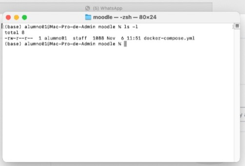

### 3. Para desplegar Moodle es necesario descargar el archivo de configuración `docker-compose.yml` que permitirá realizar la instalación de Moodle de manera sencilla y automatizada. Para eso, se realiza escribir el siguiente comando:

`$ curl -sSL https://raw.githubusercontent.com/bitnami/containers/main/bitnami/moodle/docker-compose.yml > docker-compose.yml`

### 4. Una vez descargado el archivo, se debe ejecutar con el comando:

Se puede utilizar la opción `-d` que realizará el proceso en segundo plano

`docker-compose up`

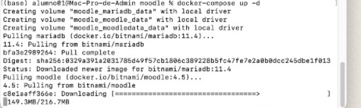

### 5. Una vez terminada la instalación y configuración del Moodle, verificar que se encuentre activo con el comando:

`docker ps`

#### 6. Comprobar que todo ha salido bien, accediendo a un navegador y colocando la dirección localhost:80 en la barra de búsqueda.

Se debe mostrar una pantalla como la siguiente

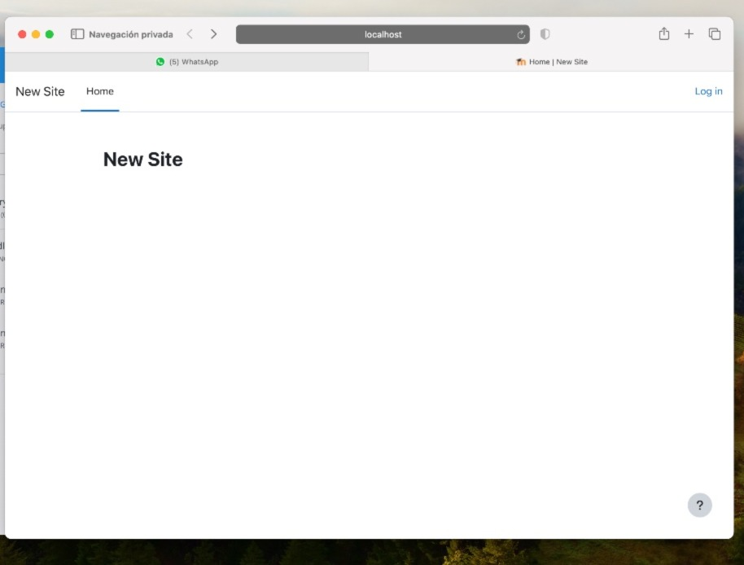

## Configuración de Moodle

### 1. Para configurar Moodle debemos iniciar sesión, para ello, hacemos clic en la opción "Log In". Se nos proporcionan las credenciales por defecto

Usuario: `user`

Contraseña: `bitnami`

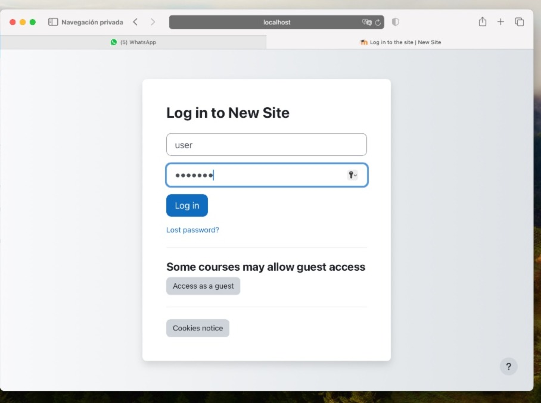

### 2. Se mostrará una pantalla como la siguiente:

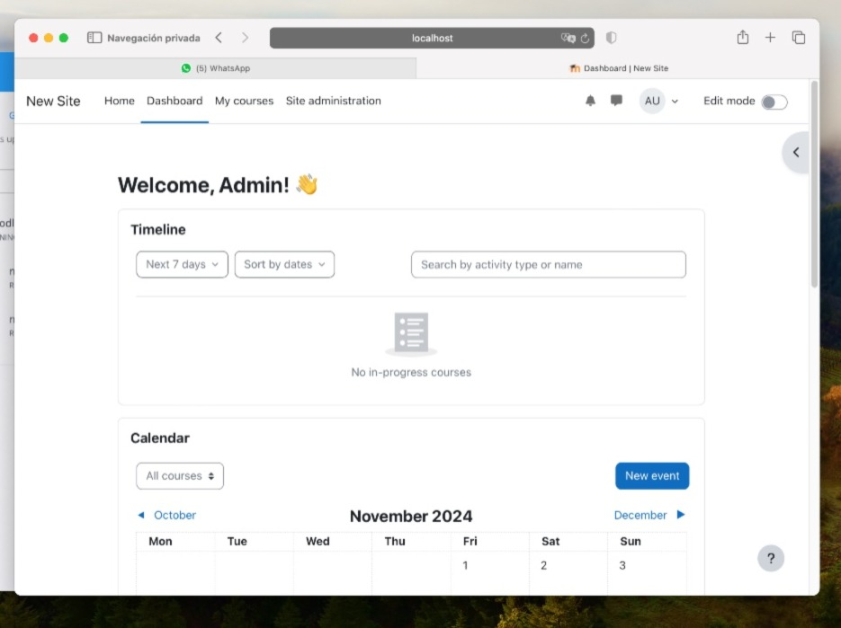

#### 1. Crear categoria

##### 1. Ir a la sección "Site Administration" y luego en el menú "Courses" daremos click en la opcion añadir categoria 

#### 2. Crear un curso

##### 1. Ir a la sección "Site Administration" y luego en el menú "Courses"

##### 2. Hacer clic en la opción "Add a new course"

##### 3. Llenamos los campos de los detalles del curso como corresponda y en la sección final seleccionamos la opción para crear el curso

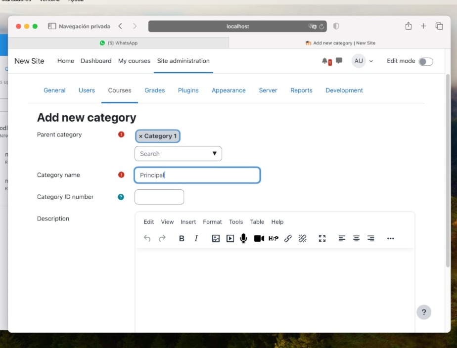

##### 4. Podremos ver el curso en la pestaña "Home" de la plataforma

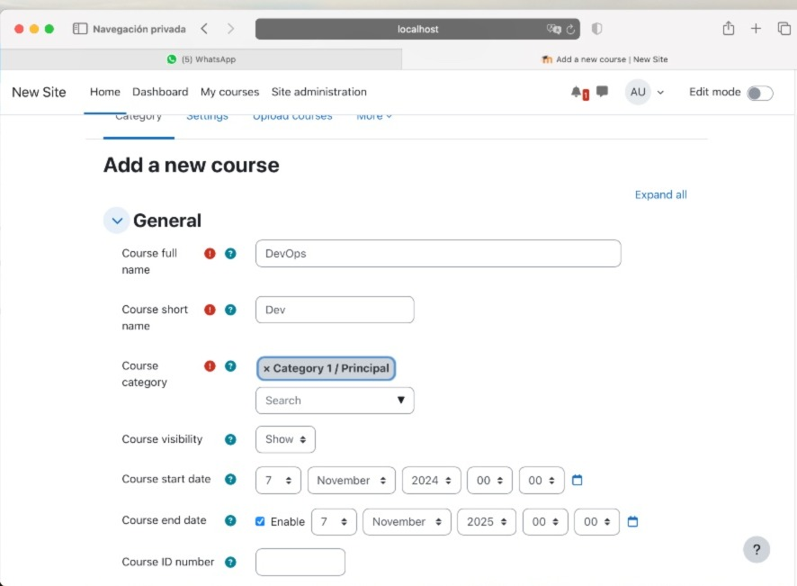

#### 3. Agregar usuarios al sistema

##### 1. Ir a la secciónd "Site Administration" y luego en el menú "Users"
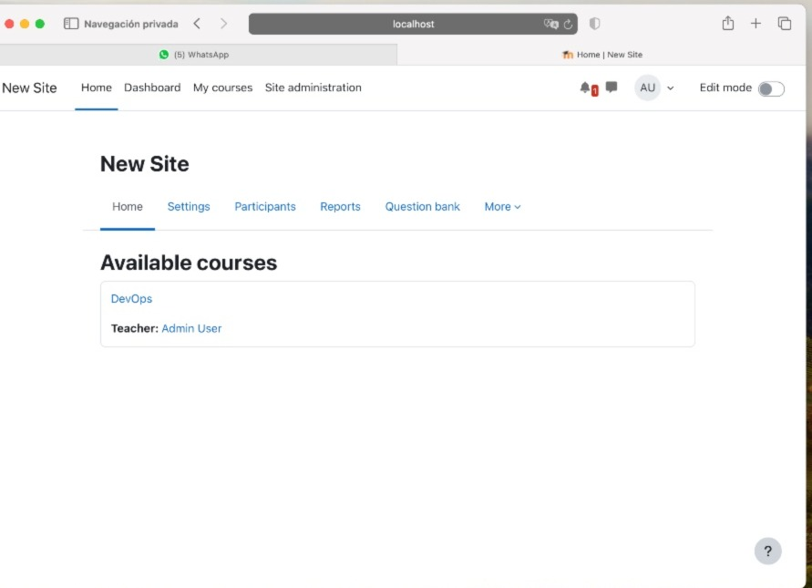
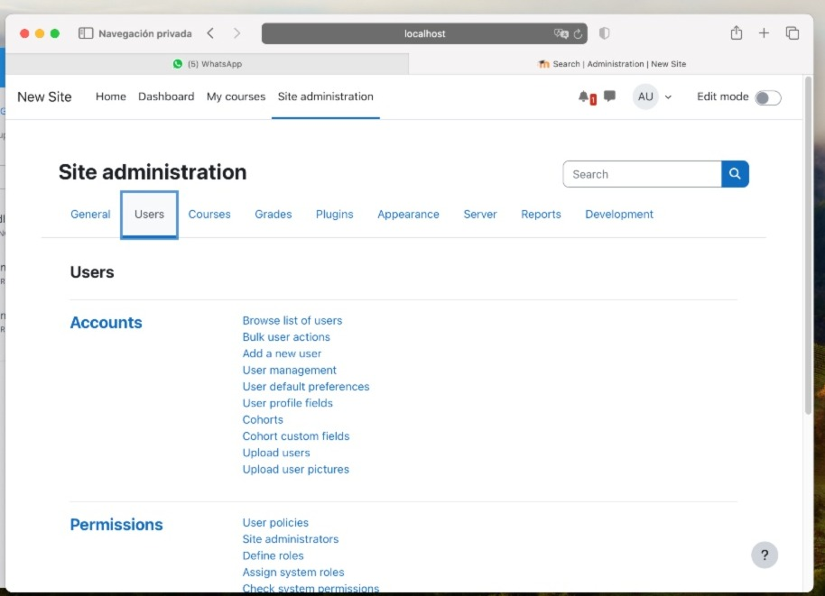

##### 2. Seleccionar la opción "Add a new user"

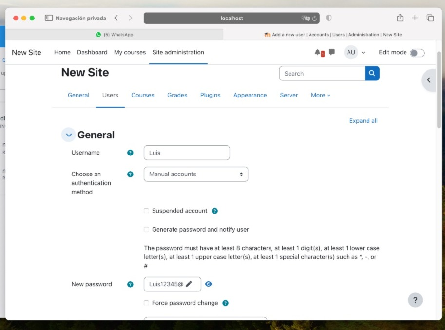

##### 3. Llenar los campos de los detalles del usuario y guardar los cambios

##### 4. Para modificar la información de un usuario, en el menú "Users", hacer clic en el menú de opciones (engranaje) donde se podrá editar o eliminar el usuario

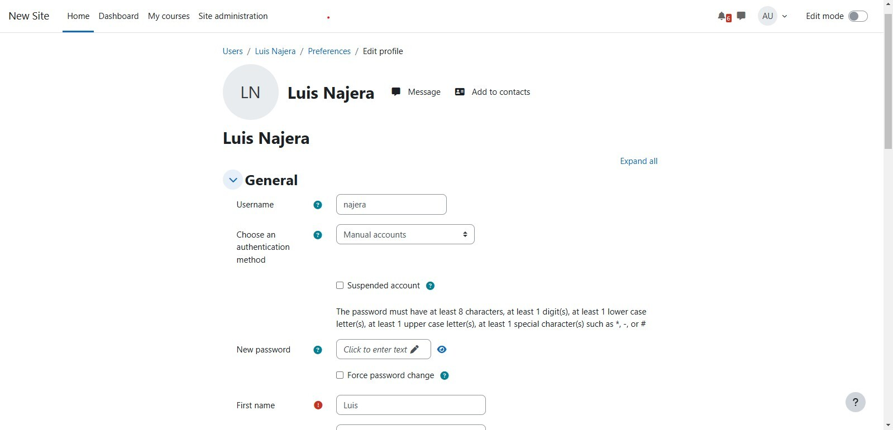

### 4. Agregar usuarios al curso

#### 1. En la página principal o en la sección "Courses" de la administración del sitio, seleccionar el curso al que se desean agregar usuarios

#### 2. Una vez en la ventana de administración del curso, seleccionar la opción "Enrol users"

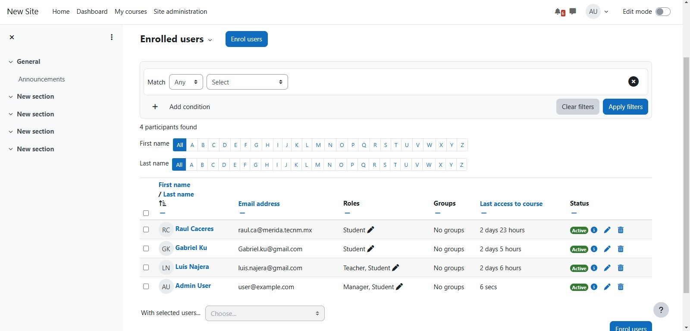

#### 3. En la ventana emergente, en el campo de búsqueda, ubicar a los usuarios que se desean agregar al curso y seleccionarlos, una vez terminado, seleccionar "Enrol users"

